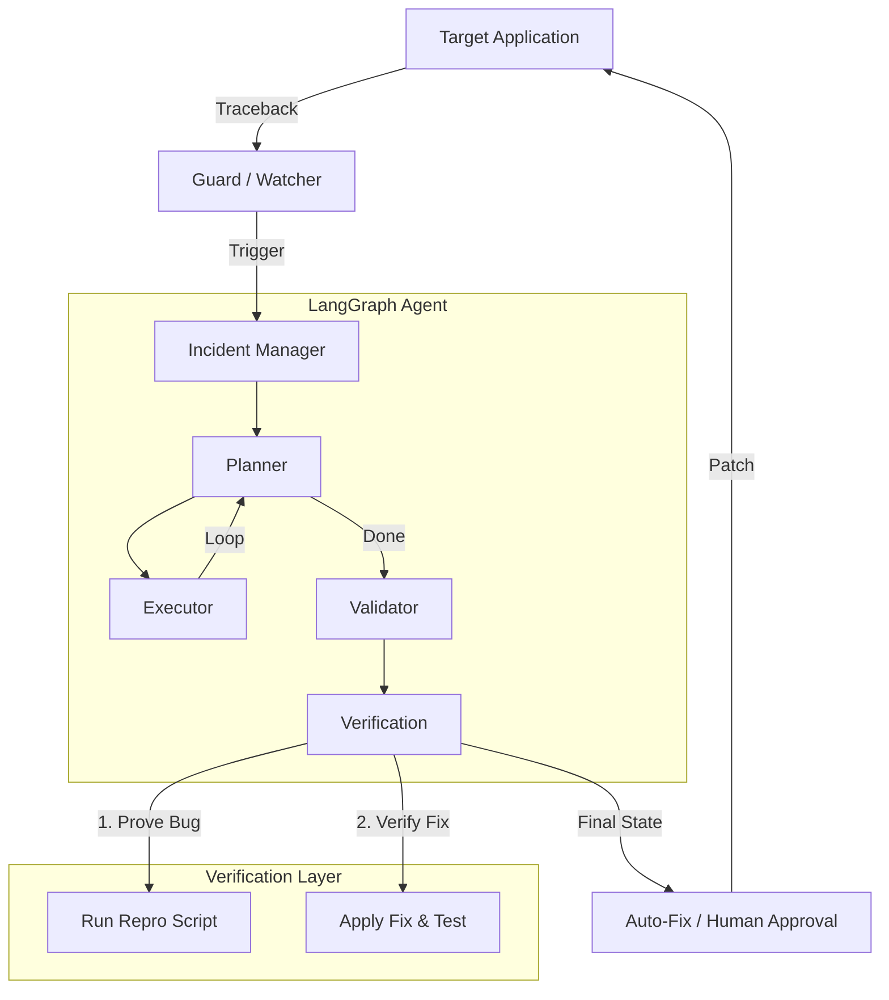

# LogGuard AI: Technical Deep Dive & Architecture

## 1. Overview
LogGuard AI is an **Autonomous Incident Response Agent**. It doesn't just "detect" errors; it investigates them like a human Site Reliability Engineer (SRE). It reads logs, analyzes stack traces, extracts specific code context, plans a fix, validates it with a self-generated test, and applies the patch.

## 2. Core Philosophy: The Agentic Loop
The system uses **LangGraph** to model incident response as a state machine. The agent operates in a cycle:

1.  **Planner**: Decisions are made based on incident severity and available logs. It plans investigation steps (e.g., `fetch_logs`, `identify_code`).
2.  **Executor**: Executes the plan. It uses a **Smart Context Reader** that extracts ±80 lines around the specific crash line found in the stack trace.
3.  **Validator**: Uses **Groq (Llama 3 70B)** to analyze the code vs. logs. It identifies the root cause and generates the full fixed file content + a reproduction Python script.
4.  **Verification**: The system uses the "Scientific Method":
    - Runs the repro script (must **fail** to confirm the bug).
    - Applies the fix temporarily.
    - Runs the repro script again (must **pass** to confirm the fix).
    - Restores the original file to wait for approval/auto-fix logic.

## 3. Operation Modes

### A. Runtime Guard (`logguard run <script>`)
**"Zero-Touch" Protection.**
- Wraps your process and captures `stderr`.
- If a crash occurs, it automatically triggers the agent.
- After a successful fix, it offers to **auto-restart** the process.

### B. Log Watcher (`logguard watch`)
**"Sidecar" Monitoring.**
- Tails log files in real-time.
- Uses **Content-Hash Deduplication**: If the same error occurs 100 times, LogGuard only analyzes it once.

### C. Post-Mortem Analysis (`logguard analyze`)
**Forensic Investigation.**
- Analyzes static log files offline or auto-discovers logs in a project root.

## 4. System Architecture

## 5. Persistence & Safety

### Persistent Storage (`~/.logguard/`)
- `incidents.log`: A JSON-lines audit trail of every incident detected.
- `reports/`: Human-readable text reports for every investigation.
- `config.yaml`: Global settings for thresholds and behavior.

### Safety Mechanisms
- **Backups**: Every file modification creates a `.bak` copy.
- **Smart Context**: Only reads relevant slices of code to stay within token limits.
- **Confidence Thresholds**: High-confidence fixes (>= 85%) can be set to auto-apply, while low-confidence ones always require review.

## 6. Connectivity
- **Groq API**: High-speed Llama 3 70B inference for real-time analysis.
- **Plyer**: Native OS notifications for background alert visibility.
